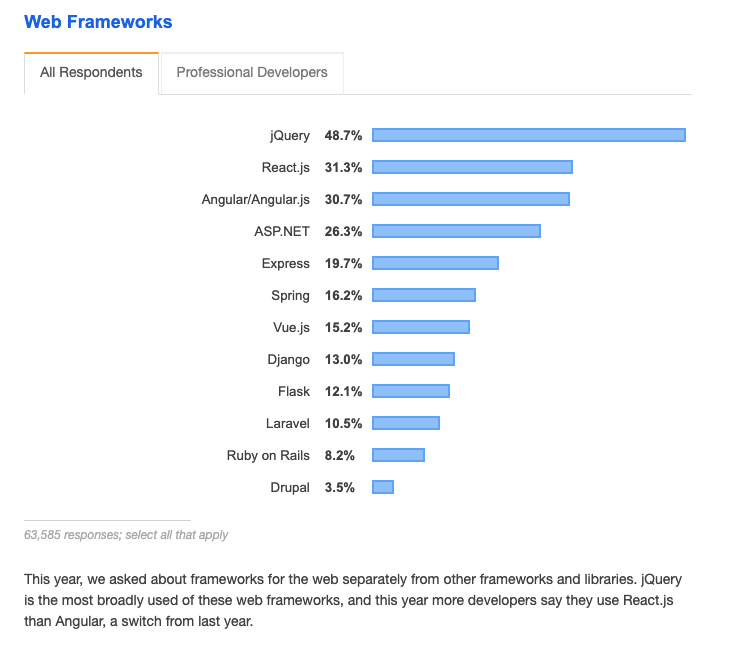

export { syntaxHighlighterPrism as theme } from "@mdx-deck/themes";

import { Notes, Image } from "mdx-deck";
import { Split, FullScreenCode } from "mdx-deck/layouts";
import BgImage from "./components/BgImage";

# Testing React in 2019

Will Ockelmann-Wagner

wow@carbonfive.com | [github.com/will-wow](http://github.com/will-wow)

---

React is Everywhere

<Notes>

In the 2019 Stack Overflow survey, React passed Angular for the first time.
But the fact that Angular is still hanging out, and jQuery is still dominant,
means React isn't going away any time soon, there's a long tail for these frameworks.

</Notes>

---

React Testing is All Over the Place

| Test Runner | Test Framework        | Test Style |
| ----------- | --------------------- | ---------- |
| Jest        | Enzyme                | Shallow    |
| Jasmine     | React Testing Library | Mount      |
| Mocha       | react-test-renderer   | Snapshot   |

<Notes>

_Testing_ React, on the other hand, is a little all over the place right now.

You've got three popular test runners, three testing frameworks, and three main types of test for unit testing. For browser testing, luckily, it seems like the internet is converging on cypress, so that's an easier decision.

</Notes>

---

I used them all... together

| Test Runner | Test FrameWork            | Test Style   |
| ----------- | ------------------------- | ------------ |
| **Jest**    | **Enzyme**                | **Shallow**  |
| Jasmine     | **React Testing Library** | **Mount**    |
| Mocha       | **react-test-renderer**   | **Snapshot** |

---

# Sample app

<iframe src="https://todo-react-testing.surge.sh/" width="1000" height="600" />

---

- Unit Testing
  - Jest
    - Enzyme Shallow
    - Enzyme Mount
    - Snapshot Testing (w/ Test Renderer): https://reactjs.org/docs/test-renderer.html)
    - React Testing Library
    - Hooks (React.useEffect + spy)
    - --coverage
  - Other options
    - Mocha/Chai
    - Jasmine
- Browser Testing
  - Cypress
  - Polly
